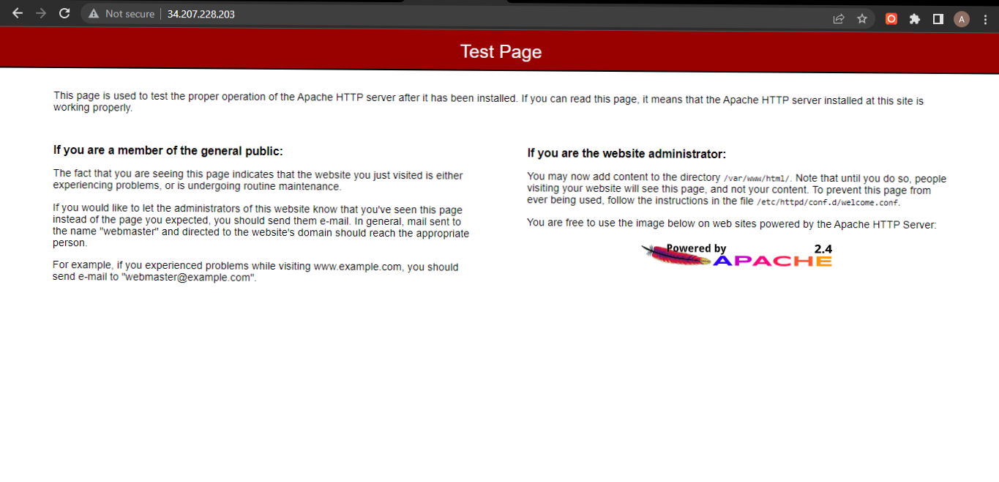

# Infrastructure as Code Challenge 1
## Problem Statement


>
> Write a CloudFormation script that Create an EC2 instance in a given VPC with allowing inbound access on TCP port 80 and also allowing unrestricted outbound access.
## Resources
    AWS::EC2::SecurityGroup
    AWS::EC2::Instance

## Prerequisites
  1. AWS CLI Installed [Here](https://docs.aws.amazon.com/cli/latest/userguide/getting-started-install.html)
  2. You should have a VPC available in your account, I will use the default 
  3. You should have a public subnet available in the VPC Selected 

## Solution

### Step 1
As we want the TCP port 80 open, so we need the a security group with these rules <br>
According to AWS [documentation](https://docs.aws.amazon.com/vpc/latest/userguide/VPC_SecurityGroups.html): ***A security group controls the traffic that is allowed to reach and leave the resources that it is associated with.***
- Writing the security Group in the form of :
  ```yaml
  # notice that the Ingress are the inboud rules and the Egress are the outboud rules
  Resources:
    SecurityGroupName:
      Type: AWS::EC2::SecurityGroup
      Properties: 
        GroupDescription: String
        GroupName: String
        VpcId: String
        SecurityGroupEgress: 
          - Egress
        SecurityGroupIngress: 
          - Ingress
        Tags: 
          - Tag
  ```
    - Note that many properties are optional; so you don't have to specify them.
  The bounding Rules [ Egress - Ingress ] are written like the example below: 
    ```yaml
    IpProtocol: tcp # -1 For to use all protocols
    FromPort: 80 # you can use -1 to allow any port
    ToPort: 80
    CidrIp: 0.0.0.0/0 # CIDR range to accept from any IP
    ```

- Right now, our template should looks like that
    ```yaml
    Resources:
      webAccessSecGroup:
        Type: AWS::EC2::SecurityGroup
        Properties:
          VpcId: vpc-0a9ea1f4fca838179
          GroupDescription: SecGroup that only allows inbound access on TCP port 80 and allows unrestricted outbound access
          SecurityGroupIngress: 
            - IpProtocol: tcp
              FromPort: 80
              ToPort: 80
              CidrIp: 0.0.0.0/0
          SecurityGroupEgress: 
            - IpProtocol: -1
              FromPort: -1
              ToPort: -1
              CidrIp: 0.0.0.0/0
    ```

### Step 2
- <strong> Let's Create the Instnace </strong>
  ```yaml
  Resources:
    InstanceName:
      Type: AWS::EC2::Instance
      Properties: 
      ImageId: string # From the AMI Catalog
      InstanceType: string
      NetworkInterfaces:
        - NetworkInterface # Network interface associated with our instance
      UserData: string # The user data script to to run at the instance launch
  ```
  - <strong> The Network Interface: </strong> Specifies a network interface that is to be attached to an instance.
    ```yaml 
    NetworkInterfaceId: String # Provide the interface Id if exists
    Description: String 
    AssociatePublicIpAddress: Boolean # To assign a public IPv4 address
    DeviceIndex: String # The position of the network interface in the attachment order. A primary network interface has a device index of 0.
    GroupSet: 
      - String # The IDs of the security groups for the network interface
    SubnetId: String # The ID of the subnet associated with the network interface.
    ```


- Putting things together
  ```yaml
  Description: >
    CloudFormation Template to Deploy EC2 Instance inside of a specific VPC 
  Resources:
    webAccessSecGroup:
      Type: AWS::EC2::SecurityGroup
      Properties:
        VpcId: vpc-0a9ea1f4fca838179
        GroupDescription: SecGroup that only allows inbound access on TCP port 80 and allows unrestricted outbound access
        SecurityGroupIngress: 
          - IpProtocol: tcp
            FromPort: 80
            ToPort: 80
            CidrIp: 0.0.0.0/0
        SecurityGroupEgress: 
          - IpProtocol: -1
            FromPort: -1
            ToPort: -1
            CidrIp: 0.0.0.0/0
    WebServerInstance:
      Type: AWS::EC2::Instance
      Properties:
        ImageId: ami-0cff7528ff583bf9a
        InstanceType: t3.micro
        NetworkInterfaces:
          - AssociatePublicIpAddress: 'true'
            DeviceIndex: '0'
            GroupSet:
            - Ref: webAccessSecGroup
            SubnetId: subnet-081e8dbee8ebb5c86
        UserData: # script that starts server at the instance launch
          Fn::Base64: !Sub |
          #!/bin/bash
          sudo yum update -y
          sudo yum install -y httpd
          sudo systemctl start httpd
          sudo systemctl enable httpd
  ```

### Step 3

<strong> Creating the stack from the CLI</strong>
```bash
aws cloudformation create-stack --stack-name ec2-vpc-stack --region us-east-1 --template-body file://template.yml 
```

## Additional Section

>    lets refine our template to not be a region specific as each region has its unique AMI ids associated to it. Let's pass parameters to our script instead of hard-coding them.

- Create `parameters.json` file
    ```json
    [
        {
            "ParameterKey": "myVPCID",
            "ParameterValue": "vpc-0a9ea1f4fca838179"
        },
        {
            "ParameterKey": "PublicSubnetID",
            "ParameterValue": "subnet-081e8dbee8ebb5c86"
        },
        {
            "ParameterKey": "AMIID",
            "ParameterValue": "ami-0cff7528ff583bf9a"
        }
    ]
    ```
- Define the Paramenters in the template `script.YAML` providing the types 
    ```YAML
    Parameters: 
    myVPCID:
        Description: VPC used to deploy our resources below
        Type: AWS::EC2::VPC::Id
    PublicSubnetID:
        Description: Subnet to be used for our Web Server
        Type: AWS::EC2::Subnet::Id
    AMIID:
        Description: AMI to use for our base image
        Type: String
    Resources:
    ...
    ```
- Now we can reference these parameters using `!Ref parameterName` as below
    ```yaml
    SubnetId: !Ref PublicSubnetID
    ```

- All you need to do to tell AWS CLI that you are using parameters by adding `--parameters file://path` to your create-stack command
    
    ```bash
    aws cloudformation create-stack  --stack-name ec2-vpc-stack --region us-east-1 --template-body file://template.yml --parameters file://parameters.json
    ```
-   Now you can access your web server using the public IP found in the instance dashboard.

    

## Useful Resources #
- [Networks ](https://www.infoq.com/articles/aws-vpc-explained/) - Some Cloud Networking Concepts explained smoothly. 
- [SecurityGroup](https://docs.aws.amazon.com/AWSCloudFormation/latest/UserGuide/aws-properties-ec2-security-group.html) - AWS security groups in cloudformation user guide documentation.
- [EC2 Instance](https://docs.aws.amazon.com/AWSCloudFormation/latest/UserGuide/aws-properties-ec2-instance.html) - AWS EC2 Instance in cloudformation user guide documentation.
- [NetworkInterface](https://docs.aws.amazon.com/AWSCloudFormation/latest/UserGuide/aws-properties-ec2-network-iface-embedded.html) - AWS network interfaces in cloudformation user guide documentation.
- [Validate Template](https://docs.aws.amazon.com/AWSCloudFormation/latest/UserGuide/using-cfn-validate-template.html) - CloudFormation's Template Validation Guide
