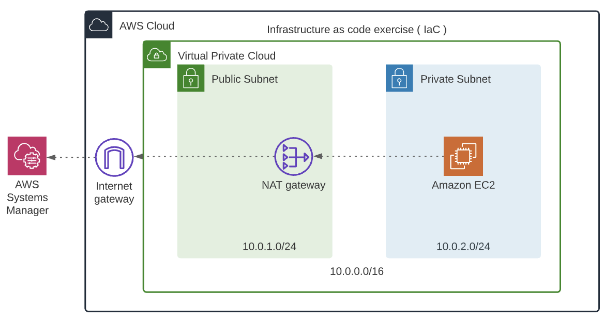

<div align="center">
  <h1 align="center">Infrastructure as Code Challenge 3</h1>
  <h3 align="center">
    Deploying a Linux server in a private subnet with IAM Role to access it from EC2 session manager 
    <br />
    <br/>
  </h3>
</div>

## Problem Statement
>
> In this exercise, you have been tasked with deploying a Linux server in a private subnet, using the infrastructure that you created in a previous exercise. In the future, this machine will be a web server that sits behind a load balancer, so it never needs to be public, as long as the Load Balancer can reach it.

<p align="center">
  
</p>


If you're wondering what is AWS System Manager. 

[`AWS Systems Manager`](https://aws.amazon.com/systems-manager/) centralizes operational data from multiple AWS services and automates tasks across your AWS resources; this service will allow you to connect to this server and verify it’s working properly. This is because you cannot SSH into a server over the internet if it doesn’t have a public IP address. Actually, you could, if you set up a VPN inside your VPC, but that’s beyond the scope of this exercise.

in order to connect your instance to AWS Systems Manager, you will be using Amazon Linux 2 for your AMI, since it’s already installed and configured in there.

## Needed Resources
1. We'll use the created network infrastructure in challenge 2
2. `EC2 Instance` An Amazon Linux-2 server in the private subnet. 
3. `SecurityGroup` A security group for the server, that allows inbound port 80 access for apache if needed.
4. `IAM Role` The IAM Role to allow EC2 Session Manager to access our server.
5. `InstanceProfile` An InstanceProfile will allow passing the IAM role to our server. 
<br>

       AWS::EC2::Instance
       AWS::EC2::SecurityGroup
       AWS::IAM::Role
       AWS::IAM::InstanceProfile


## Solution

- To access a variable from that stack we createed in challenge 2, use the `ImportValue` intrinsic function 
  ```yaml
  VpcId: 
    Fn::ImportValue:
          name
  ```

- Creating the Server's security group that allows the server to send any traffic to anywhere and receive only TCP traffic on port 80
    ```yaml
    ServerSecGroup:
      Type: AWS::EC2::SecurityGroup
      Properties:
        VpcId: 
          Fn::ImportValue:
          !Sub "${EnvironmentName}-VPCID"
        SecurityGroupIngress: 
          - IpProtocol: tcp
            FromPort: 80
            ToPort: 80
            CidrIp: 0.0.0.0/0
        SecurityGroupEgress: 
          - IpProtocol: -1
            FromPort: -1
            ToPort: -1
            CidrIp: 0.0.0.0/0
    ```
    - The `!Sub` intrinsic function substitutes the parameter **EnvironmentName** in the provided string because we exported as `UdacityProject-VPCID`

-----------

- Now, let's get to the most important part in this challenge which is allowing the AWS System Manager to manage our instance. As the service/resource isn't inside the vpc and our server is private, so we will create IAM Role and attach to it the suitable policy for the needed permission, then create IAM instance profile to pass the IAM Role to the instance.

  **`Note that` :** _IAM Roles manage who has access to your AWS resources, whereas IAM policies control their permissions_. 
  
  **Types of polices**
    - `Managed policies` -  pre-defined Polices that are managed by Amazon and can be reused and attached to multiple services.
    - `Inline policies` - These policies are managed by users and applied directly to IAM entities.
  
  We will use the managed policy [`AmazonSSMManagedInstanceCore` »»](https://aws.amazon.com/blogs/mt/applying-managed-instance-policy-best-practices/)   
  
<br>

  1. Creating the role and assigning EC2 as a trusted entity
      
      ```yaml
      SMAccessRole: 
        Type: "AWS::IAM::Role"
        Properties:
          AssumeRolePolicyDocument: # The trust policy that is associated with this role
            Version: "2012-10-17"
            Statement:
              - Effect: Allow
                Principal:
                  Service:
                    - ec2.amazonaws.com
                Action:
                  - 'sts:AssumeRole'
          ManagedPolicyArns:
            - arn:aws:iam::aws:policy/AmazonSSMManagedInstanceCore # The attached policy
      ```
    
  2. Creating the IAM instance profile
      
      ```yaml
      ServerInstanceProfile: 
        Type: "AWS::IAM::InstanceProfile"
        Properties: 
          Roles: 
            - !Ref SMAccessRole
      ```    
-----------

- <strong> The final step is Creating the Instnace, but don't forget to attach the instance profile to it. </strong>
  ```yaml
  Resources:
    InstanceName:
      Type: AWS::EC2::Instance
      Properties: 
      ImageId: !Ref InstanceImageId # AMI Parameter
      InstanceType: !Ref InstanceType
      IamInstanceProfile: !Ref ServerInstanceProfile
      NetworkInterfaces:
        - NetworkInterface # Network interface associated with our instance
  ```
  - <strong> The Network Interface: </strong> Specifies a network interface that is to be attached to an instance.
    ```yaml 
    AssociatePublicIpAddress: false # To prevernt assigning a public IPv4 address
    DeviceIndex: 0 # The position of the network interface in the attachment order. A primary network interface has a device index of 0.
    GroupSet: 
      - Ref: ServerSecurityGroup # The IDs of the security groups for the network interface
    SubnetId: 
      Fn::ImportValue:
        !Sub "${EnvironmentName}-PRI-ST" # The ID of the private subnet
    ```

<br>


### Used Parameters

  > - `EnvironmentName` - An environment name to be prefix to the resources
  > - `InstanceImageId` - The AMI ID of the Instance
  > - `InstanceType` -  Used Amazon Instace Type 

### Imported values from another stack

> - `${EnvironmentName}-VPCID` -  The Id of the used VPC
> - `${EnvironmentName}-PRI-ST` -  The Id of the private subnet 


### Creating the stack from the CLI 

  - Remember to include the `--capabilities "CAPABILITY_IAM" "CAPABILITY_NAMED_IAM"` option. This is because we are creating an IAM Role to provide permissions and we want to make the person executing create-stack aware of this fact.

    ```bash
    aws cloudformation create-stack  --stack-name private-server --template-body file://template.yml --parameters file://template-parameters.json --region us-east-1 --capabilities "CAPABILITY_IAM" "CAPABILITY_NAMED_IAM" 
    ```

## References #
- [IAM Role & IAM Ploicy](https://www.learnaws.org/2022/03/03/iam-roles-policies/) - A Useful article that explains the Roles and Polices
- [IAM Role](https://docs.aws.amazon.com/AWSCloudFormation/latest/UserGuide/AWS_IAM.html) - AWS IAM Roles in the cloudformation user guide documentation.
- [SecurityGroup](https://docs.aws.amazon.com/AWSCloudFormation/latest/UserGuide/aws-properties-ec2-security-group.html) - AWS security groups in cloudformation user guide documentation.
- [NetworkInterface](https://docs.aws.amazon.com/AWSCloudFormation/latest/UserGuide/aws-properties-ec2-network-iface-embedded.html) - AWS network interfaces in cloudformation user guide documentation.
- [EC2 Instance](https://docs.aws.amazon.com/AWSCloudFormation/latest/UserGuide/aws-properties-ec2-instance.html) - AWS EC2 Instance in cloudformation user guide documentation.